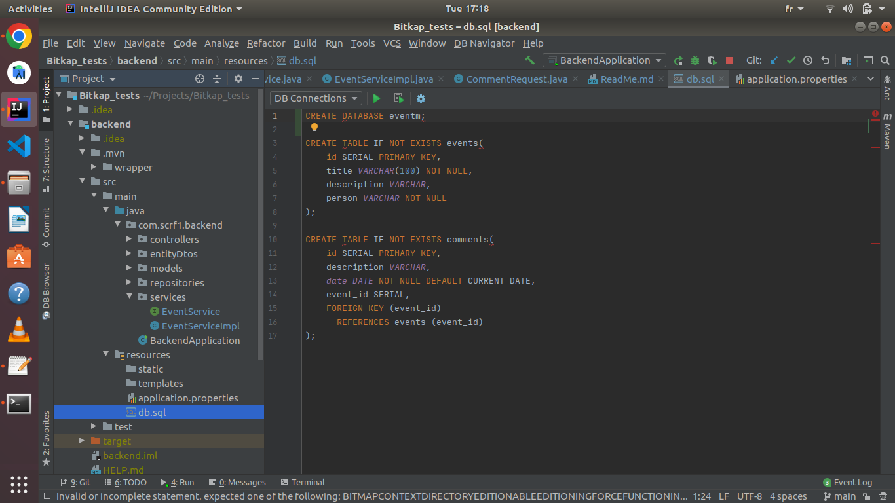
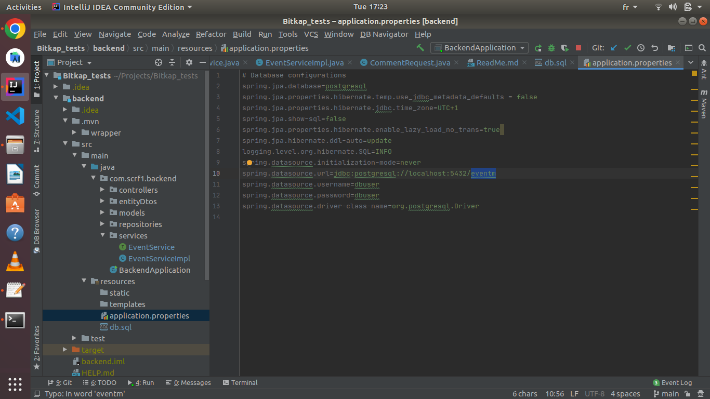
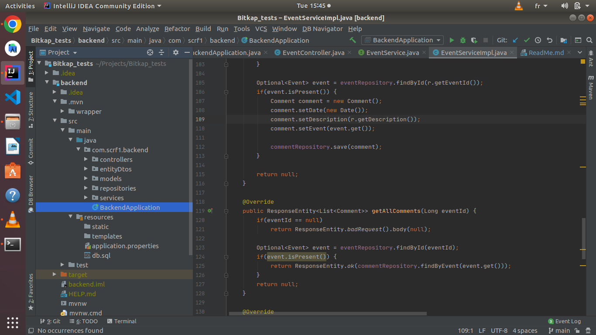

# Configurations préalables
Pour ce tutoriel, nous utiliserons une base de données PostgreSQL.\
La configuration consiste en 2 étapes:
* la création de la base de données
* relier la BD à l'application

 ## 1. Création de la BD
 Il suffit d'exécuter le script qui se trouve à l'adresse suivante:
 > /Bitkap_tests/backend/src/main/resources/db.sql
 >
 
 
 ## 2. Relier la BD à l'application
 La première des choses est de se rendre au fichier suivant:
 > /Bitkap_tests/backend/src/main/resources/application.properties
 >
 
 
 Ensuite, modifier les informations suivantes:
 * ***spring.datasource.username*** : par le nom d'utilisateur de votre BD postgresql
 * ***spring.datasource.password***: par le mot de passe de votre BD postgresql
 
 _NB: Au besoin vous pourrez modifier le port de postgresql (si vous n'utilisez pas le 5432) au niveau de la ligne suivante:_ \
 _***spring.datasource.url=jdbc:postgresql://localhost:5432/eventm***_

# Execution de l'application

Pour exécuter le backend en mode développement, il y'a deux possibilités :
 * En utilisant la commande maven
 * En utilisant l'éditeur de code (exemple intellij)
 
## 1. En utilisant maven
 La première des choses est de se rendre dans le dossier de l'application:
 > cd backend/
 >
 Puis, on installe les dépendances nécessaires:
 > mvn install
 >
 Ensuite, on exécute la commande maven suivante pour lancer l'application:
 > mvn spring-boot:run
>
_NB: Si maven n'est pas installé, veuillez exécuter la commande suivante:
***sudo apt install maven***_

## 2. En utilisant l'éditeur de code
 Pour ce cas, nous utiliserons l'éditeur intellij. 
 Pour ce faire, il suffit de choisir le fichier indiqué dans l'arborescence à gauche: ***BackendApplicatiion.java*** tel indiqué dans l'image qui suit:
 
 
 Et cliquer sur le bouton d'exécution.
 
 
 # Cas de tests
 Pour effectuer les tests, vous pouvez choisir les outils de tests tels que postman, ...
 Ou alors exécuter les commandes curl.
  ## 1. Tests sur les évènements
   ### 1.1. Créer un évènement
   > curl -X POST -H "Content-Type: application/json" -d '{"title":"Event1", "description": "special Event", "person": "Jean"}' http://localhost:8080/events/create
   >
   * Type de méthode: POST
   * Type de contenu: JSON
   * URL: http://localhost:8080/events/create
   * RequestBody: {"title":"Event1", "description": "special Event", "person": "Jean"}
   
   ### 1.2. Visualiser la liste des évènements
   > curl http://localhost:8080/events/all?currentPage=0&pageSize=3
   >
   * Type de méthode: GET
   * Paramètres de requête: currentPage (un entier représentant la page courante), pageSize(entier qui représente la taille de chaque page) 
   * URL: http://localhost:8080/events/all
   
   ### 1.3. Visualiser un évènement en particulier
   > curl http://localhost:8080/events/1
   >
   * Type de méthode: GET
   * URL: http://localhost:8080/events/1
   (le 1 de la fin représente l'id de l'évènement) 
   
   ### 1.4. Supprimer un évènement
   > curl -X DELETE http://localhost:8080/events/delete/1
   >
   * Type de méthode: DELETE
   * URL: http://localhost:8080/events/delete/1
   (le 1 de la fin représente l'id de l'évènement)
   
   ### 1.5. Modifier un évènement
   >  curl -X PUT -H "Content-Type: application/json" -d '{"title":"Special Event", "description":"This is a special event"}' http://localhost:8080/events/update?eventId=1
   >
   * Type de méthode: PUT
   * Type de contenu: JSON
   * URL: http://localhost:8080/events/update
   * Paramètre de requête: eventId (qui est l'id de l'évènement)
   * RequestBody: {"title":"Special Event", "description":"This is a special event"}
   
  ## 2. Tests sur les commentaires
    
   ### 2.1. Créer un commentaire
   > curl -X POST -H "Content-Type: application/json" -d '{"eventId":1, "description": "special Event"}' http://localhost:8080/comments/create
   >
   * Type de méthode: POST
   * Type de contenu: JSON
   * URL: http://localhost:8080/comments/create
   * RequestBody: {"eventId":1, "description": "special Event"}
   
   ### 2.2. Visualer l'ensemble des commentaires d'un évènement
   > curl http://localhost:8080/comments/all?eventId=1
   >
   * Type de méthode: GET
   * URL: http://localhost:8080/events/comments/all
   * Paramètre de requête: eventId (représentant l'id de l'évènement correspondant)
   * Réponse: un JSON listant l'ensemble des commentaires accompagné de l'évènement correspondant
   
   ### 2.3. Visualiser un commentaire en particulier
   > curl http://localhost:8080/comments/1
   >
   * Type de méthode: GET
   * URL: http://localhost:8080/comments/1 (où 1 représente l'id du commentaire)
   * Réponse: un JSON contenant le commentaire ainsi que l'évènement correspondant
   
   ### 2.4. Supprimer un commentaire
   > curl -X DELETE http://localhost:8080/comments/delete/1
   >
   * Type de méthode: DELETE
   * URL: http://localhost:8080/comments/delete/1
      (le 1 de la fin représente l'id du commentaire)
      
   ### 2.5. Modifier un commentaire
   > curl -X PUT -H "Content-Type: application/json" -d '{"description":"Updated description of comment", "commentId":1}' http://localhost:8080/comments/update
   >
   * Type de méthode: PUT
   * Type de contenu: JSON
   * URL: http://localhost:8080/comments/update
   * RequestBody: {"description":"Updated description of comment", "commentId":1}   
      