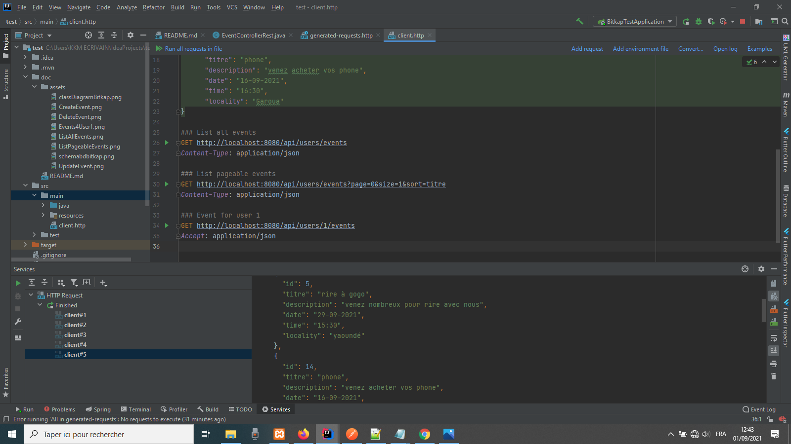

# Events management API (for Spring Boot Developer)

## Table of Contents
* [Specifications](#Specifications)
* [Technologies Used](#Technologies)
* [Class Diagram](#Class Diagram)
* [Schema of database](#Schema of database)
* [Completions](#Completions)
* [Installation Instructions](#Installation Instructions)
* [require Software](#Require Software)
* [process of test API](#Process of test API)
* [method 1 : using postman](#method 1 : using postman)
* [method 2 : using file client.http](#method 2 : using file client.http)
* [Room for Improvement](#room-for-improvement)
* [Acknowledgements](#acknowledgements)
* [Contact](#contact)

## Specifications
The goal of the exercise is to make a Rest API for event management. It must be possible to :
- add, modify, delete and view events(in list form an individually)
- manage comments for an event(create, modify, delete and view). 

For the return of the list of events, each event must contain its list of comments.
The list of events must allow pagination.
The returns must be a JSON type.

An event consists of a title of 100 characters maximum, description and a person involved in the event.
A comment consists of a description and date and must be linked to an event.

### Technologies

- Java (Spring Boot)
- MySQL

#### Class Diagram

#### Schema of database

### Completions
Working Functions

- Create user
- Display user
- Update user
- delete user
- create event
- update event
- Display pageable events by userId.
- Display pageable events
- delete event
- Display pageable comments
- Display pageable comment in function one event and ane user
- Create comment
- Update comment
- Delete comment

Unit Testing
- User Service
- User Controller
- Event Service
- Event Controller
- Comment Service
- Comment Controller

### Installation Instructions
Dependencies Needed:
- MySQL
- spring-boot-starter-data-jdbc
- spring-boot-starter-data-jpa
- spring-boot-starter-web
- mysql-connector-java
- lombok
- hibernate-validator

### Require Software
- StarUML(for create class diagram)
- IDE of your choice (in my side I used IntelliJ)
- XAMPP or WAMP (inside started services apache and MySQL)
- Postman (for test all your Endpoints) or a client http

### Process of test API
once downloading code, extract it, 
* copy it and paste it on storage projects of your ide  
* open it in your ide
* you must have internet connexion for a download all dependencies
* JDK 8 is require
* Start service apache and MySQL in XAMPP
* Create database (bdbitkap)
* import bdbitkap.sql in your database (src/main/resources/bdbitkap.sql)
* Run your project

#### method 1 : using postman  
open Postman and following all instructions bellow in image

This content is available in a folder (doc)
###### Create Event

###### Delete Event

###### Update Event

###### List all events

###### List Pageable Events

###### Events for user 1

#### method 2 : using file client.http
open this file in this path : src/main/client.http and following all instructions bellow in image

###### Create Event

###### Delete Event

###### Update Event

###### List all events

###### List Pageable Events

###### Events for user 1

## Room for improvement:
- The add date, time and locality from event
- The linking comment to an event and user.
- The list of comments and users allow pagination.

To do:
- secure this application for that only those persons who are authorised and authenticated must be use.
- minimize processing in a backend for that system must be soft and preconize processing in a frontend.

## Acknowledgements

- This project is a test given by Bitkap.
- Many thanks to you.

## Contact
Created by <a href="maximiliendenver@gmail.com">Maxwell</a>  - feel free to contact me!
