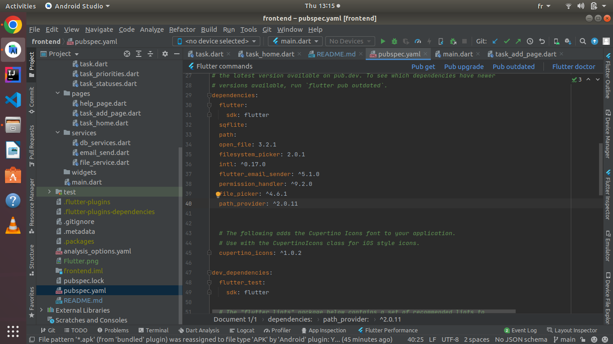
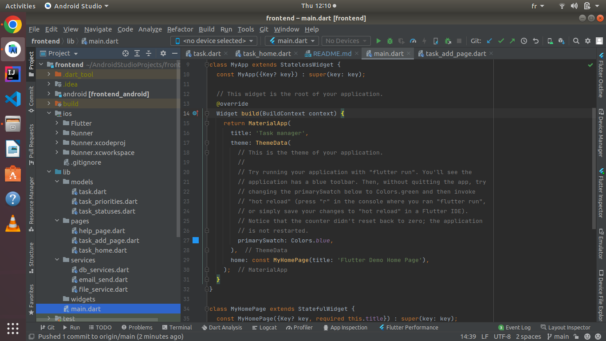
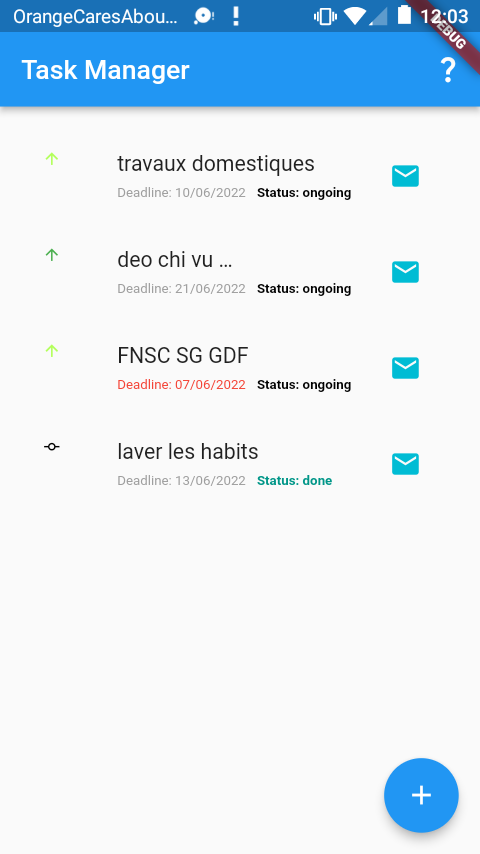
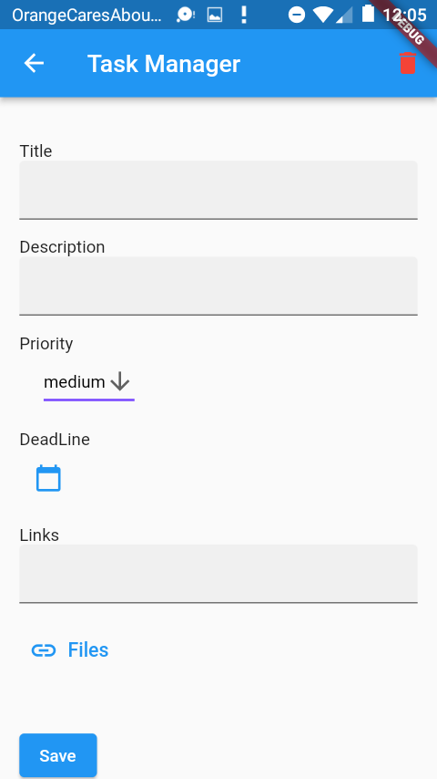
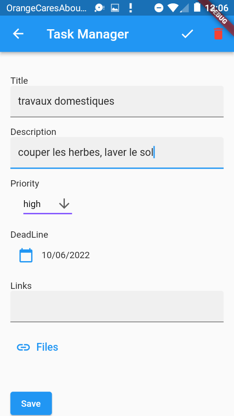
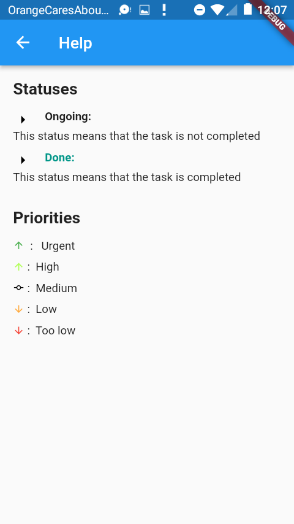

# Installation

Pour installer l'application en mode debug, il existe deux manières;
 * En utilisant l'éditeur Android studio
 * En utilisant le CLI de Flutter

 ## 1. En utilisant l'éditeur Android Studio
Il faut tout d'abord ouvrir le projet à l'adresse relative suivante:
> /Bitkap_tests/frontend
> 

Puis ouvrir le fichier :
> pubspec.yaml
> 
Ensuite cliquer sur le bouton ***Pub get*** situé dans la zone de texte tel qu'indiqué dans la figure suivante:

Enfin, exécuter l'application (situé dans le fichier ***lib/main***):

 ## 2. En utilisant le CLI de Flutter
 Ouvrir le dossier du projet:
 > cd /Bitkap_test/frontend
 >  

 Ensuite exécuter la commande:
 > flutter pub get
 > 

 Enfin, lancer l'application en faisant:
 > flutter run lib/main.dart
 > 

# Tester l'application
La page principale de l'application est la suivante:

Elle est constitué de la liste de chaque tâches enregistrées.\ 
Pour chaque tâche, nous avons les informations sur son titre, sa deadline (qui devient ***rouge*** si le délai est passé),
ainsi que son statut. \
L'icône à droite représente la priorité de chaque tâche.\
L'icône de messagerie à droite permet d'envoyer les tâches par email.
\
Pour insérer une tâche, il suffit de cliquer sur le bouton ***"+"*** situé en bas à droite de la page principale tel qu'indiqué par la figure suivante:

Pour modifier une tâche (que ce soit modifier ses informations, changer le status ou même supprimer la tâche), il faut cliquer sur celle ci (en étant dans la page principale). On
aura alors la page suivante:

 * le bouton "juste" sur la barre d'action permet de changer le statut de la tâche
 * le bouton "delete" permet de supprimer la tâche

\
Pour connaître à quoi correspond les différents symboles utilisés, veuillez cliquer sur le bouton ***"?"*** situé sur la barre d'action de la page principale.
Vous serez redirigé vers la page suivante:
